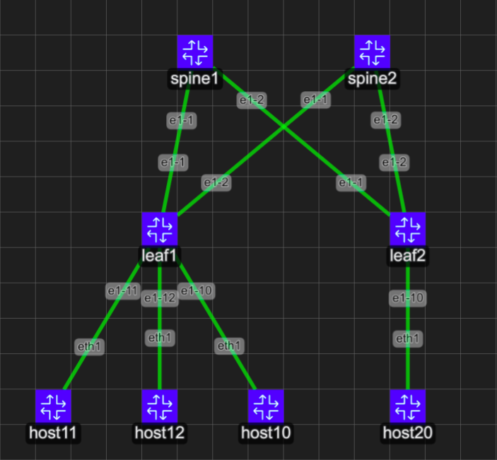

# What do we have so far

After creating our topology with the YAML file, we will have the following configuration below:



This is just the barebones topology with only the management interfaces automatically configured thanks to containerlab.

## Goal

Our goal here is to create a fully configured leaf and spine topology with 2 spine and 2 leaf devices that interconnect 3 hosts with BGP as our main routing protocol to create our routes.

To make life easier, in the folder start_config, I left starting configurations in json files for the switches and scripts to run for the hosts that you can copy paste as needed.

For the switches, go into the /etc/opt/srlinux/config.json and replace what is in there with the starting configurations 

For the hosts, they will be bash scripts that you can make executable then run.

## Configuring Interfaces 

For this initial configuration we will configure the interfaces that point towards both the hosts and the spine switches to establish connectivity from hosts to spines.

```
--{ running }--[  ]--
A:root@spine1# enter candidate

--{ candidate shared default }--[  ]--
A:root@spine1# 


```
