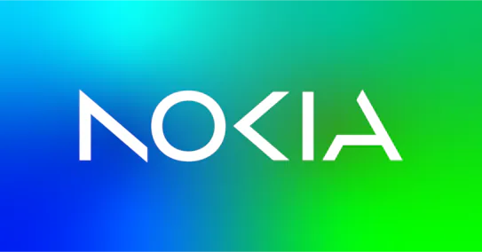

<a id="readme-top"></a>

[![Stargazers][stars-shield]][stars-url]
[![Issues][issues-shield]][issues-url]
[![project_license][license-shield]][license-url]
[![LinkedIn][linkedin-shield]][linkedin-url]


<!-- PROJECT LOGO -->
<br />
<div align="center">
  <a href="https://github.com/Sh1n0e/Nokia-Homelab">
    
  </a>

<h3 align="center">Nokia Homelab</h3>

  <p align="center">
    This repo is dedicated to me recreating the lab topology we got to configure throughout our time learning for the Data Center Fabric Fundamentals Certification with Nokia
    <br />
    <a href="https://github.com/Sh1n0e/Nokia-Homelab"><strong>Explore the docs »</strong></a>
    <br />
    <br />

  </p>
</div>


<!-- TABLE OF CONTENTS -->
<details>
  <summary>Table of Contents</summary>
  <ol>
    <li>
      <a href="#about-the-project">About The Project</a>
      <ul>
        <li><a href="#built-with">Built With</a></li>
      </ul>
    </li>
    <li>
      <a href="#getting-started">Getting Started</a>
      <ul>
        <li><a href="#prerequisites">Prerequisites</a></li>
        <li><a href="#installation">Installation</a></li>
      </ul>
    </li>
    <li><a href="#usage">Usage</a></li>
    <li><a href="#roadmap">Roadmap</a></li>
    <li><a href="#contributing">Contributing</a></li>
    <li><a href="#license">License</a></li>
    <li><a href="#contact">Contact</a></li>
    <li><a href="#acknowledgments">Acknowledgments</a></li>
  </ol>
</details>


### Built With

* [![Alpine-Linux][Alpine-Linux]][Alp-url]
* [![Docker][Docker]][Docker-url]
* [![JSON][JSON]][JSON-url]
* [![YAML][YAML]][YAML-url]
* Nokia SR Linux --> Badge to be created soon
* Containerlab --> Badge to be created soon 

<p align="right">(<a href="#readme-top">back to top</a>)</p>


<!-- GETTING STARTED -->
## Getting Started

This is an example of how you may give instructions on setting up your project locally.
To get a local copy up and running follow these simple example steps.

### Prerequisites

On a linux server or linux compatible device you need to install the following:

* Docker - This will host the images for Nokia SR Linux based routers that we will be working on
```sh
  sudo apt-get update # Debian/Ubuntu based systems

 
  sudo apt-get install ca-certificates curl gnupg # Prerequisites to allow apt or dnf to work with repos

  sudo install -m 0755 -d /etc/apt/keyrings
  curl -fsSl https://download.docker.com/linux/ubuntu/gpg | sudo gpg --dearmor -o /etc/apt/keyrings/docker.gpg
  sudo chmod a+r /etc/apt/keyrings/docker.gpg

  echo \
      "deb [arch="$(dpkg --print-architecture)" signed-by=/etc/apt/keyrings/docker.gpg] https://download.docker.com/linux/ubuntu \
      "$(. /etc/os-release && echo "$VERSION_CODENAME")" stable" | \
      sudo tee /etc/apt/sources.list.d/docker.list > /dev/null

  sudo apt-get update 
  sudo apt-get install docker-ce docker-ce-cli containerd.io docker-buildx-plugin docker-compose-plugin

 sudo systemctl enable --now docker # start it up if it doesn't happen automatically'
```

  * Containerlab - What will be acting sort of like the main emulating "device" that recreates the topology that we will be making
 ```sh
 curl -sL https://containerlab.dev/setup | sudo -E bash -s "all"
 ```

<p align="right">(<a href="#readme-top">back to top</a>)</p>


<!-- ROADMAP -->
## Roadmap

- [ ] Include how to set up initial topology
- [ ] Each relevant stage, include configurations and theory to show how they work
- [ ] For each section, include detailed breakdowns of how the command works (A little more in depth explanation than step 2)

<p align="right">(<a href="#readme-top">back to top</a>)</p>

<!-- CONTACT -->
## Contact

Shawn Rae - Email - shawndlopezrae@gmail.com
LinkedIn - [![LinkedIn][linkedin-shield]][linkedin-url]

Project Link: [https://github.com/Sh1n0e/Nokia-Homelab](https://github.com/Sh1n0e/Nokia-Homelab/Home-Lab)

<p align="right">(<a href="#readme-top">back to top</a>)</p>


<!-- ACKNOWLEDGMENTS -->
## Acknowledgments

* [Eric Brestenbach](https://www.linkedin.com/in/eric-brestenbach-55511a1/)- For teaching the material that provided the knowledge I needed to be able to perform what is required for this writeup over the reading week of October 2025 
* [Max W.](https://www.linkedin.com/in/jitengwangmax/)- For providing further assistance in understanding the material from the course and in my recreation of the topology 
* [Michael Anderson](https://www.linkedin.com/in/professor-michael-anderson/) - For being able to organize the opportunity to learn directly from Nokia Employees about Data Centre Fundamentals over the reading week from October 21st to 24th, 2025

<p align="right">(<a href="#readme-top">back to top</a>)</p>


<!-- MARKDOWN LINKS & IMAGES -->
<!-- https://www.markdownguide.org/basic-syntax/#reference-style-links -->
[contributors-shield]: https://img.shields.io/github/contributors/Sh1n0e/Nokia-Homelab.svg?style=for-the-badge
[contributors-url]: https://github.com/Sh1n0e/Nokia-Homelab/graphs/contributors
[forks-shield]: https://img.shields.io/github/forks/Sh1n0e/Nokia-Homelab.svg?style=for-the-badge
[forks-url]: https://github.com/Sh1n0e/Nokia-Homelab/network/members
[stars-shield]: https://img.shields.io/github/stars/Sh1n0e/Nokia-Homelab.svg?style=for-the-badge
[stars-url]: https://github.com/Sh1n0e/Nokia-Homelab/stargazers
[issues-shield]: https://img.shields.io/github/issues/Sh1n0e/Nokia-Homelab.svg?style=for-the-badge
[issues-url]: https://github.com/Sh1n0e/Nokia-Homelab/issues
[license-shield]: https://img.shields.io/github/license/Sh1n0e/Nokia-Homelab.svg?style=for-the-badge
[license-url]: https://github.com/Sh1n0e/Nokia-Homelab/blob/master/LICENSE.txt
[linkedin-shield]: https://img.shields.io/badge/-LinkedIn-black.svg?style=for-the-badge&logo=linkedin&colorB=555
[linkedin-url]: https://linkedin.com/in/shawn-rae-525b6616b
[product-screenshot]: images/screenshot.png
<!-- Shields.io badges. You can a comprehensive list with many more badges at: https://github.com/inttter/md-badges -->
[Next.js]: https://img.shields.io/badge/next.js-000000?style=for-the-badge&logo=nextdotjs&logoColor=white
[Next-url]: https://nextjs.org/
[React.js]: https://img.shields.io/badge/React-20232A?style=for-the-badge&logo=react&logoColor=61DAFB
[React-url]: https://reactjs.org/
[Vue.js]: https://img.shields.io/badge/Vue.js-35495E?style=for-the-badge&logo=vuedotjs&logoColor=4FC08D
[Vue-url]: https://vuejs.org/
[Angular.io]: https://img.shields.io/badge/Angular-DD0031?style=for-the-badge&logo=angular&logoColor=white
[Angular-url]: https://angular.io/
[Svelte.dev]: https://img.shields.io/badge/Svelte-4A4A55?style=for-the-badge&logo=svelte&logoColor=FF3E00
[Svelte-url]: https://svelte.dev/
[Laravel.com]: https://img.shields.io/badge/Laravel-FF2D20?style=for-the-badge&logo=laravel&logoColor=white
[Laravel-url]: https://laravel.com
[Bootstrap.com]: https://img.shields.io/badge/Bootstrap-563D7C?style=for-the-badge&logo=bootstrap&logoColor=white
[Bootstrap-url]: https://getbootstrap.com
[JQuery.com]: https://img.shields.io/badge/jQuery-0769AD?style=for-the-badge&logo=jquery&logoColor=white
[JQuery-url]: https://jquery.com 
[Alpine-Linux]: https://img.shields.io/badge/Alpine%20Linux-0D597F?logo=alpinelinux&logoColor=fff
[Alp-url]: https://www.alpinelinux.org/
[Docker]: https://img.shields.io/badge/Docker-2496ED?logo=docker&logoColor=fff
[Docker-url]: https://www.docker.com/
[JSON]: https://img.shields.io/badge/JSON-000?logo=json&logoColor=fff
[JSON-url]: https://www.json.org/json-en.html
[YAML]: https://img.shields.io/badge/YAML-CB171E?logo=yaml&logoColor=fff
[YAML-url]: https://yaml.org/
